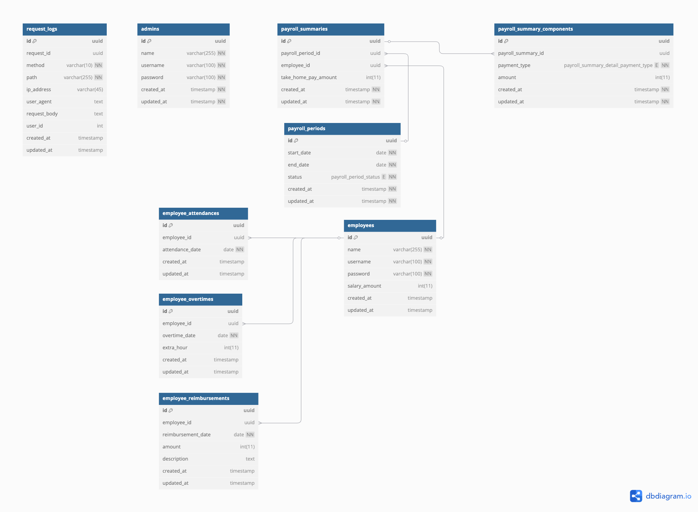

# Dealls Payroll Service
A robust NestJS-based payroll management system featuring automated processing, attendance tracking, and complete employee management capabilities.

## Table of Contents
- [Project Structure](#project-structure)
- [Tech Stack](#tech-stack)
- [Technical Architecture](#technical-architecture)
- [Features](#features)
- [Getting Started](#getting-started)
  - [Prerequisites](#prerequisites)
  - [Installation](#installation)
  - [Configuration](#configuration)
  - [Usage](#usage)
- [Testing](#testing)
- [Database Schema (DDL)](#database-schema)
- [Key Notes](#key-notes)

## Project Structure
```plaintext
src/
├── admin-auth/       # Admin authentication
├── admin-payroll/    # Payroll management
├── common/           # Shared resources
├── database/         # Database configurations
├── employee-auth/    # Employee authentication
├── employee-activity/# Employee activities
├── entities/         # TypeORM entities
└── employee-payroll/ # Employee payroll views
```

## Tech Stack
- **Backend**: [NestJS](https://nestjs.com/), [TypeScript](https://www.typescriptlang.org/)
- **Database**: [PostgreSQL](https://www.postgresql.org/), [TypeORM](https://typeorm.io/)
- **Queue**: [Redis](https://redis.io/), [BullMQ](https://docs.bullmq.io/)
- **Testing**: [Jest](https://jestjs.io/)
- **Deployment**: [Docker](https://www.docker.com/)

## Technical Architecture

The architecture follows a microservices pattern:
- **API Layer**: NestJS REST API handling client requests
- **Queue Layer**: Redis/BullMQ for async job processing
- **Data Layer**: PostgreSQL with TypeORM for persistence

Request flow:
1. Client sends HTTP request
2. NestJS handles routing and middleware
3. Controllers process requests
4. Services handle business logic
5. Queue processors handle async tasks
6. Data persistence through TypeORM
7. Response returned to client

## Features
- **Authentication System**
  - Separate auth for employees and admin
  - JWT-based authentication
  - Role-based access control

- **Payroll Management**
  - Automated payroll calculation
  - Working days computation
  - Overtime processing
  - Reimbursement handling
  - Asynchronous processing using BullMQ

- **Employee Activities**
  - Attendance tracking
  - Overtime submissions
  - Reimbursement requests

## Prerequisites
The following tools are **mandatory** for running this application:

### Make (Required)
- **Version**: 3.81 or higher
- **Check**: `make --version`
- **Install**:
  - MacOS: `brew install make`
  - Ubuntu: `sudo apt-get install make`
  - Windows: Install via [chocolatey](https://chocolatey.org/): `choco install make`

### Git (Required)
- **Version**: 2.30.0 or higher
- **Check**: `git --version`
- **Install**:
  - MacOS: `brew install git`
  - Ubuntu: `sudo apt-get install git`
  - Windows: Download from [git-scm.com](https://git-scm.com/)

### Docker (Required)
- **Version**: 20.10.0 or higher
- **Check**: `docker --version`
- **Requirements**:
  - At least 4GB of RAM allocated to Docker
  - Virtualization enabled in BIOS
- **Install**: Follow [official Docker installation guide](https://docs.docker.com/get-docker/)

### Docker Compose (Required)
- **Version**: 2.0.0 or higher
- **Check**: `docker compose version`
- **Note**: Included with Docker Desktop for Mac and Windows
- **Install**: Follow [official Docker Compose installation guide](https://docs.docker.com/compose/install/)

> ⚠️ **Important**: All components above are mandatory. The application will not work without these prerequisites properly installed and configured.

## Installation
Clone the repository:
```bash
git clone https://github.com/dani-susanto/dealls-payroll-service.git
cd dealls-payroll-service
```

## Configuration
Copy the example environment file:
```bash
cp .env.example .env
```

The .env file should contain:
```env
# Database
DB_HOST=postgres
DB_PORT=5432
DB_USERNAME=postgres
DB_PASSWORD=postgres
DB_NAME=payroll_db

# Redis
REDIS_HOST=redis
REDIS_PORT=6379

# JWT
JWT_SECRET=your-secret-key
JWT_EXPIRATION=15m
```

## Setup
Run the installation script:
```bash
chmod +x install.sh
./install.sh
```

The script will:
- Set up environment variables
- Start Docker containers
- Install dependencies
- Run database migrations
- Start the application

## Usage
Access the services at:
- API: http://localhost:3000/api
- Documentation: http://localhost:3000/api/docs
- Adminer: http://localhost:3001
- Redis Commander: http://localhost:3002

### Admin Access
Default Admin credentials:
```
username: dealls_admin
password: dealls_admin123+
```

### Employee Access
To get employee credentials:
1. Access Adminer at http://localhost:3001
2. Login using:
   ```
   System: PostgreSQL
   Server: dealls-payroll-db:5432
   Username: postgres
   Password: postgres
   Database: postgres
   ```
3. Go to `employee` table
4. Find an employee's username
5. Use password format: `{username}123+`

Example:
```
username: john.doe
password: john.doe123+
```

## Testing
Run unit tests:
```bash
make test
```

## Database Schema


The schema consists of the following main tables:
- **admin**: Stores admin user data
- **employee**: Stores employee information
- **employee_attendance**: Records daily attendance
- **employee_overtime**: Records overtime submissions
- **employee_reimbursement**: Tracks reimbursement requests
- **payroll_period**: Defines payroll periods
- **payroll_summary**: Stores payroll calculation results
- **payroll_summary_component**: Breaks down payment components

## Key Notes
- Built with scalability in mind using NestJS modules
- Implements queue-based asynchronous payroll processing
- Uses TypeORM for database management
- Includes comprehensive test coverage
- Docker-based development environment
- Swagger API documentation
